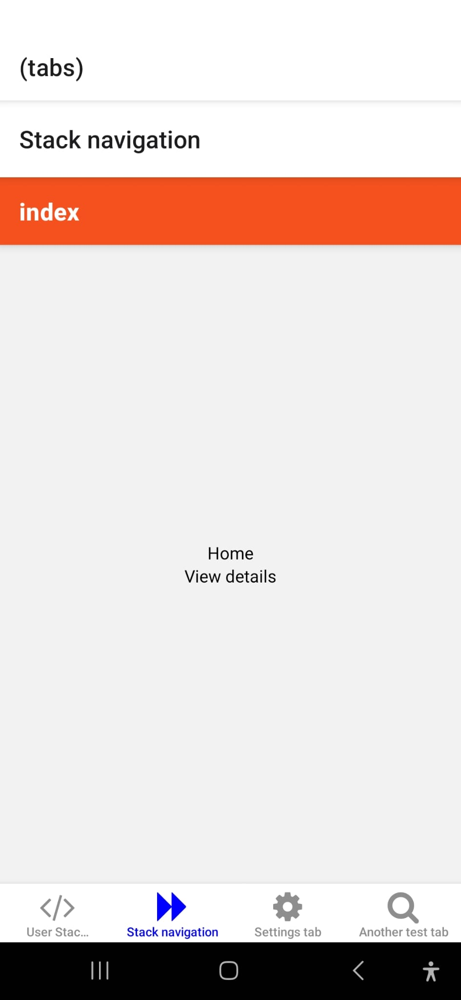
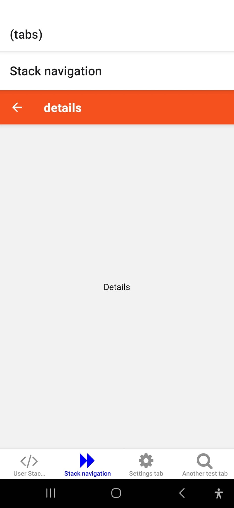
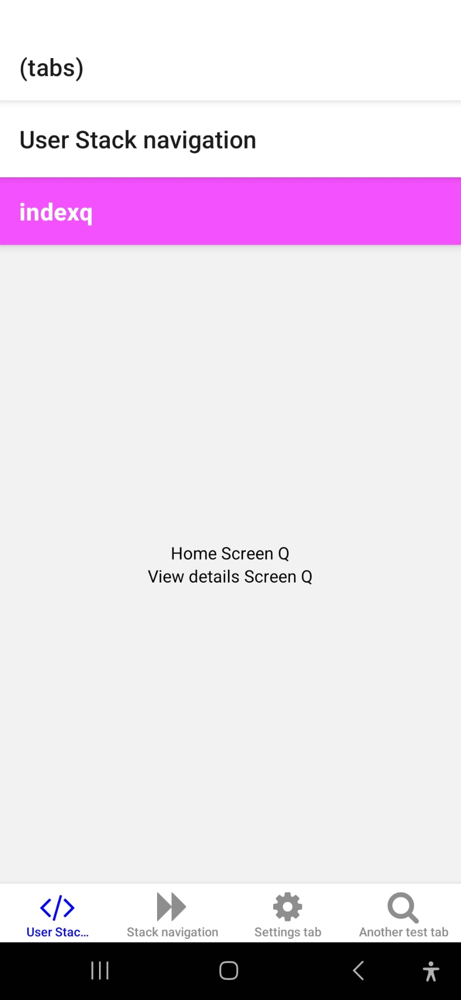
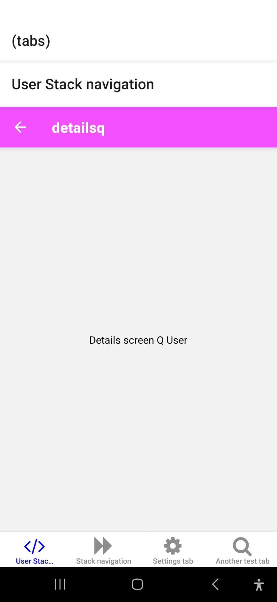
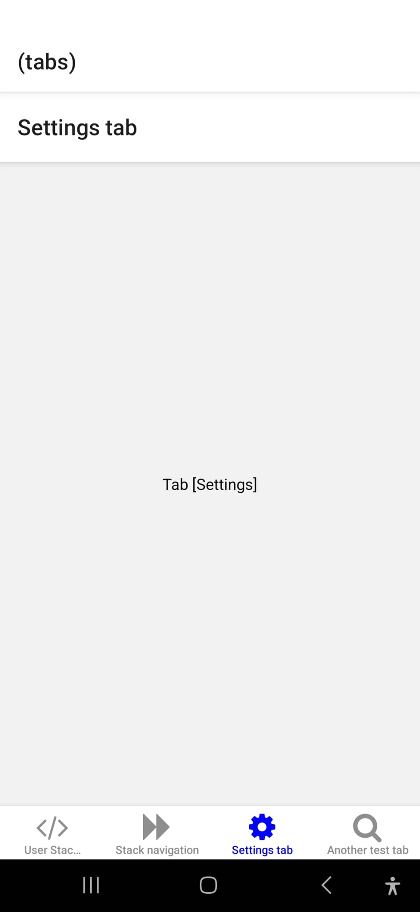
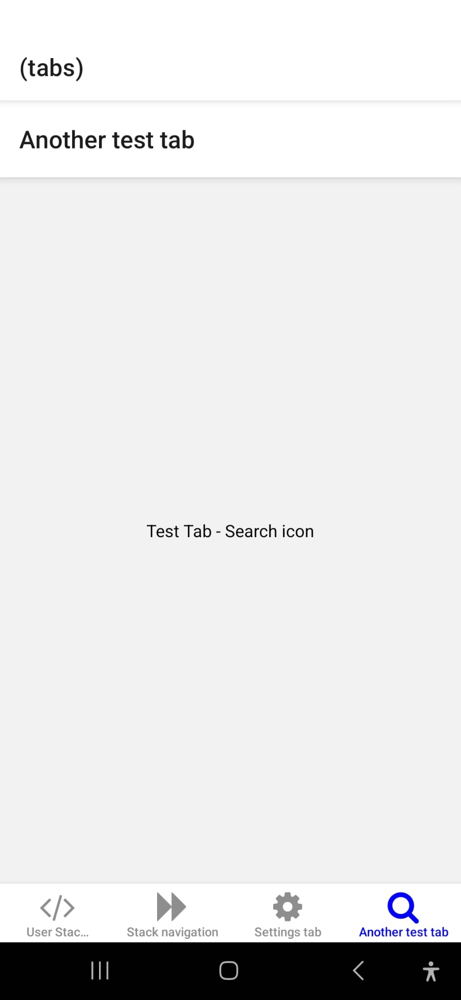

# Welcome to your Expo app 👋

This is an [Expo](https://expo.dev) project created with [`create-expo-app`](https://www.npmjs.com/package/create-expo-app).

## Get started

1. Install dependencies

   ```bash
   npm install
   ```

2. Start the app

   ```bash
    npx expo start
   ```

In the output, you'll find options to open the app in a

- [development build](https://docs.expo.dev/develop/development-builds/introduction/)
- [Android emulator](https://docs.expo.dev/workflow/android-studio-emulator/)
- [iOS simulator](https://docs.expo.dev/workflow/ios-simulator/)
- [Expo Go](https://expo.dev/go), a limited sandbox for trying out app development with Expo

You can start developing by editing the files inside the **app** directory. This project uses [file-based routing](https://docs.expo.dev/router/introduction).

## Get a fresh project

When you're ready, run:

```bash
npm run reset-project
```

This command will move the starter code to the **app-example** directory and create a blank **app** directory where you can start developing.

## Learn more

To learn more about developing your project with Expo, look at the following resources:

- [Expo documentation](https://docs.expo.dev/): Learn fundamentals, or go into advanced topics with our [guides](https://docs.expo.dev/guides).
- [Learn Expo tutorial](https://docs.expo.dev/tutorial/introduction/): Follow a step-by-step tutorial where you'll create a project that runs on Android, iOS, and the web.

## Join the community

Join our community of developers creating universal apps.

- [Expo on GitHub](https://github.com/expo/expo): View our open source platform and contribute.
- [Discord community](https://chat.expo.dev): Chat with Expo users and ask questions.

## Overview of what is what

- `app.json` - this is where we control, sort of what we would call the metadata of the application , like it controls the name of the app when it goes to play store, icon you see when you install the application on your phone ..etc.

## Played around on how stack & Tab Navigation can be done using expo

- Now i got it - i was confused at the start but now i feel better when i did it step by step ,took time but never mind initial understanding of how things working helps, now i can just go ahead and build the app, documentation is great. went through <https://docs.expo.dev/develop/file-based-routing/> & <https://docs.expo.dev/router/advanced/tabs/>
- When the app loads , it shows the index.tsx file present in (home) & remaining as usual.For this commit & test code - i will upload pictures for my assets/images/reference to get back to this later on what is displayed for what code i have tried.

     

- ESLint is a tool for identifying and reporting on patterns found in ECMAScript/JavaScript code, with the goal of making code more consistent and avoiding bugs.
  - ESLint is completely pluggable. Every single rule is a plugin and you can add more at runtime. You can also add community plugins, configurations, and parsers to extend the functionality of ESLint.
  - <https://github.com/facebook/react-native/tree/main/packages/eslint-config-react-native>
  - `yarn add --dev eslint prettier @react-native/eslint-config`
  - created file `.eslintrc` and telling eslint you're going to use React Native Community Configuration.
  - In `package.json` - "lint": "eslint . --ext .js" in scripts - calling eslint package and saying (.) means check whole directory but only for the `js` files.
  - - `yarn add react-native-paper` - for fun

```tsx
$ yarn lint
yarn run v1.22.22
$ eslint . --ext .js,.jsx,.ts,.tsx
Warning: React version not specified in eslint-plugin-react settings. See https://github.com/jsx-eslint/eslint-plugin-react#configuration .

C:\Users\abhis\Desktop\ReactNative\projects\MealsToGo\app\(tabs)\(home)\_layout.tsx
   5:5  error  'React' must be in scope when using JSX  react/react-in-jsx-scope
  16:7  error  'React' must be in scope when using JSX  react/react-in-jsx-scope
  17:7  error  'React' must be in scope when using JSX  react/react-in-jsx-scope

C:\Users\abhis\Desktop\ReactNative\projects\MealsToGo\app\(tabs)\(home)\details.tsx
  5:5  error  'React' must be in scope when using JSX  react/react-in-jsx-scope
  6:7  error  'React' must be in scope when using JSX  react/react-in-jsx-scope
....
...
..
.
✖ 33 problems (33 errors, 0 warnings)

```

- Fix was for me to add `import React from 'react';` in the following error files .. silly
- After Fix looks like :

```jsx
$ yarn lint
yarn run v1.22.22
$ eslint . --ext .js,.jsx,.ts,.tsx
Warning: React version not specified in eslint-plugin-react settings. See https://github.com/jsx-eslint/eslint-plugin-react#configuration .
Done in 4.15s.
```

## General Idea

- **app directory**

The **app** is a special directory. Any file you add to this directory becomes a route inside the native app and reflects the same URL for that route on the web.

- **Root layout**

Traditionally, React Native projects are structured with a single root component (defined as **App.js** or **index.js**). Similarly, the first layout file (**\_layout.tsx**) inside the **app** directory is considered to be the single root component.

- **Create a route**

In the **app** directory, a route is created by adding a file or a nested directory that includes **index.tsx** file.

For example, to create an initial route of your app, you can add **index.tsx** to the **app** directory.

## Resources

- Card : <https://callstack.github.io/react-native-paper/docs/components/Card/>
- styled-components can be used with React Native in the same way and with the same import.<https://styled-components.com/docs/basics#react-native> - styleSheets are great , but we want more consistency - there's something called DesignOps - when you're building a product , taking into account all of the constraints and making sure that the constraints are fit,picture perfect along the way - a design system - a theme - which gives us consistency `styled-components is the result of wondering how we could enhance CSS for styling React component systems. By focusing on a single use case we managed to optimize the experience for developers as well as the output for end users.` - so we will move away from StyleSheet syntax and create components having their styling already on it. For example : Also DO `yarn add styled-components` & `yarn add --dev @types/styled-components` & `yarn add @types/styled-components @types/styled-components-react-native`

```tsx
import React from "react";
import styled from "styled-components/native";

const StyledView = styled.View`
  background-color: papayawhip;
`;

const StyledText = styled.Text`
  color: #bf4f74;
`;

class MyReactNativeComponent extends React.Component {
  render() {
    return (
      <StyledView>
        <StyledText>Hello World!</StyledText>
      </StyledView>
    );
  }
}
```

- Now if we want to acheive consistency - we go use this [Theming](https://styled-components.com/docs/advanced) - styled-components has full theming support by exporting a `<ThemeProvider>` wrapper component. This component provides a theme to all React components underneath itself via the `context API`. In the render tree all styled-components will have access to the provided theme, even when they are multiple levels deep.
- use this <https://react.dev/> to understand things like what's [contextAPI](https://react.dev/learn/passing-data-deeply-with-context#context-an-alternative-to-passing-props) in [react](https://legacy.reactjs.org/docs/context.html).`Context provides a way to pass data through the component tree without having to pass props down manually at every level.`
- let's setup our theme: (create infrastructure folder & theme folder as well)

- Loading custom fonts:
  - expo google fonts - [github](https://github.com/expo/google-fonts) - Do `npx expo install @expo-google-fonts/inter expo-font` - get oswald & lato fonts - `yarn add @expo-google-fonts/oswald` & `yarn add @expo-google-fonts/lato`
- star.js : Icon of star - we need [react-native-svg](https://github.com/software-mansion/react-native-svg) to load starIcon
  - Use with [svg files](https://github.com/software-mansion/react-native-svg/blob/main/USAGE.md#use-with-svg-files) - `import { SvgXml } from 'react-native-svg';`
  - Now we need to render the star icon the amount of times rating occurs.

```bash
yarn expo start --clear

The -c or --clear flag is used to clear the Metro bundler cache. The Metro bundler cache is used to speed up subsequent starts of the Expo development server. However, sometimes the cache can become outdated or corrupted, leading to issues such as:

Unexpected behavior: The app might not reflect the latest code changes.
Build errors: The bundler might fail to build the app due to cached artifacts conflicting with new dependencies or code.
Clearing the cache forces Metro to rebuild everything from scratch, ensuring you have a clean and consistent build. It's often helpful to use the -c flag in situations like:

After updating dependencies: When you add, remove, or update npm or yarn packages, clearing the cache can prevent issues related to dependency changes.
When encountering unexplained errors: If you are experiencing strange errors or the app is not behaving as expected, clearing the cache is a good first step to rule out cache-related problems.

For a fresh start: Using -c ensures you are starting with a clean slate, which can be useful when you want to be absolutely sure you are running the latest version of your code and dependencies.
In summary, npx expo start -c or yarn expo start --clear starts the Expo development server with a cleared cache, which is useful for resolving cache-related issues and ensuring a fresh start, especially after dependency changes or when encountering unexpected behavior.
```

- `open.js` - Adding Open Now SVG.
